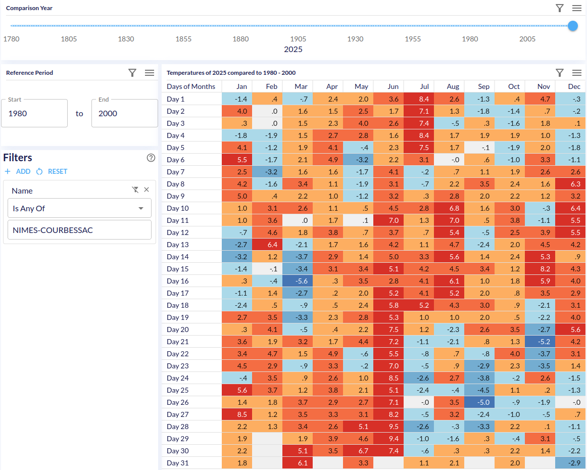

**Multi-dimensional analysis of Météo-France data to settle the "Back in my days" apéro debate once and for all.**



Living in the South of France, you are biologically required to endure a loop of small talk about the heat.
`The-Pastis-Climate-Index` project is the professional-grade solution for the data-driven resident who is tired
of nodding politely. It provides the tools to extract, model, and visualize over 500 million rows of French
meteorological history, turning anecdotal nostalgia into undeniable proof.

|            |                                                                                                                                       |
|:-----------|:--------------------------------------------------------------------------------------------------------------------------------------|
| Ammunition | [500M+ Rows](https://www.data.gouv.fr/datasets/donnees-climatologiques-de-base-horaires/) (Météo-France data stretching back to 1780) |
| Weapon     | [MDX](https://doc.iccube.com/?ic3topic=server.mdx.index) (Multi-dimensional analysis)                                                 |
| Machinery  | [icCube](https://www.iccube.com/) (OLAP engine)                                                                                       |
|            |                                                                                                                                       |

**Use it responsibly, preferably with a glass of Pastis in hand. Cheers!**

```
/src
    /main
        /java
            /crazydev.meteo
                /MeteoShell.java
                /...
```

The Java code (and IntelliJ/Gradle project) to download `MétéoFrance` data and generate `icCube`
input files. Have a look to the class `MeteoShell` that acts as the entry point of the project.

```
/schema
```

The definition of the icCube `Meteo` schema built from the generated `icCube` files 
(update the datasource folders).

```
/dashboards
```

Several `icCube` dashboards to start playing with.

Happy hacking!

_
